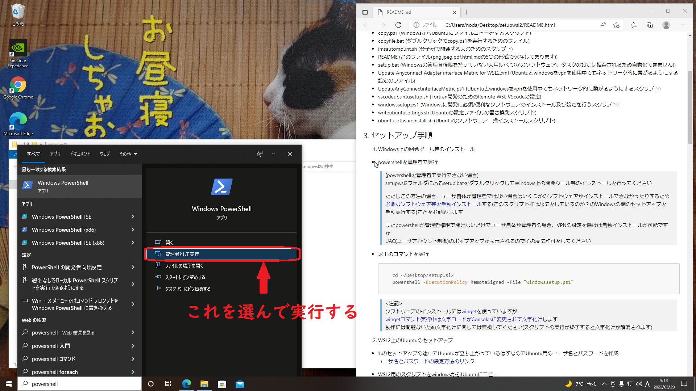
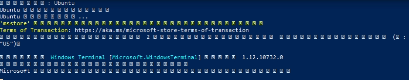

# Windowsセットアップ説明書

<!-- vscode-markdown-toc -->
1. [はじめに](#introduction)
1. [注意](#attention)
1. [セットアップ手順](#setup)
1. [このスクリプトはなにをしているのか？](#whatsdoingthesescripts)
1. [ファイル一覧](#files)

## 1. <a name='introduction'></a>はじめに

このリポジトリはリモートサーバでプログラム等を実行したい人に向けて、できるだけ簡単にWindowsのセットアップを可能にするために作られたスクリプト群です  

このスクリプトを実行することで以下のことができるようになります  

- [OpenSSH](https://docs.microsoft.com/ja-jp/windows-server/administration/openssh/openssh_install_firstuse)をインストールすることで、ssh鍵を使ったリモートサーバへのログインが可能になる
- [Visual Studio Code](https://code.visualstudio.com/)を使って便利な拡張機能を使ったテキスト処理、インプットの作成などが可能になる
- ~/.ssh/configを編集することで、sshやrsync,scpなどのコマンドの手順を簡略化できるようになる

## 2. <a name='attention'></a>注意

- 各コマンドは選択してctrl+cでコピー、ctrl+vで貼り付けすることができます

- インターネットとの通信がかなりあるので<span style="color:darkorange">高速で安定なネットワーク(できれば有線)環境下で実行してください</span>

- ノートパソコンの場合<span style="color:darkorange">充電の残量</span>にも注意してください(基本的には充電しながらのセットアップを推奨します)

## 3. <a name='setup'></a>セットアップ手順

### 3.1. リポジトリのダウンロードと配置

- [このリポジトリ](https://github.com/kohei-noda-qcrg/windows_setup)にアクセスして<span style="background-color:darkgreen;color:white">Code</span>からZipファイルをダウンロードします


- セットアップ手順を簡単にするためダウンロードしたzipファイル(windows_setup-main)を<span style="color:darkorange">デスクトップに配置</span>してください  
(powershellやwsl2に慣れている人は以降のコマンドのパスをzipファイルを展開したあとのフォルダのパスに置き換えて実行してもらってもよいです)

  以下の画像のようにwindows_setup-mainフォルダがデスクトップにあればOKです  
  

- デスクトップに配置したzipファイルの上で右クリックし、すべて展開(T)...を選択します
  

- 以下のようなウィンドウが表示されるので展開(E)を選択します
  

- 以下の画像のようにデスクトップにwindows_setup-mainフォルダが表示されればOKです
  

### 3.1. Windows上の開発ツール等のインストール

- powershellを<span style="color:darkorange">管理者で実行</span>します  
  
  <details><summary style="color:red">powershellを管理者で実行できない場合</summary><div>

  >(powershellを管理者で実行できない場合)  
  >[必要なソフトウェア等を手動インストール](#whatsdoingthesescripts)する(このスクリプト群はなにをしているのか？のWindowsの欄のセットアップを手動実行する)ことをお勧めします  
  >
  >またpowershellが管理者権限で開けないだけでユーザ自体が管理者の場合、管理者でない状態で自動インストールが可能ですが  
  >UAC(ユーザアカウント制御)のポップアップが表示されるのでその度に許可をしてください  

  </div></details>

- 以下のコマンドを実行

  ```powershell
    cd ~/Desktop/windows_setup-main/windows_setup-main/scripts
    powershell -ExecutionPolicy ByPass -File "windowssetup.ps1"
  ```

  

  > <注記>  
  > ソフトウェアのインストールには[winget](https://github.com/microsoft/winget-cli)を使っていますが  
  > [wingetコマンド実行中は文字コードがConsolasに変更されて文字化け](http://mystia04.net/?p=961)します  
  > 動作には問題ないため文字化けに関しては無視してください(スクリプトの実行が終了すると文字化けが解消されます)

  ↓文字化けの様子  
  

### 3.4. SSHの設定

  <span style="color:darkorange">計算機へのログインのためのユーザを作成済み</span>の場合、以下の設定を行ってください  

- [~/.ssh/config](https://qiita.com/passol78/items/2ad123e39efeb1a5286b#sshconfig%E3%82%92%E6%9B%B8%E3%81%8F%E3%81%A8%E4%BD%95%E3%81%8C%E5%AC%89%E3%81%97%E3%81%84%E3%81%8B)の編集

  - まずPowershellを開いて、\~/.sshディレクトリの作成、configファイルの作成、configファイルをメモ帳で開く操作を以下のコマンドで行います
    ```sh
      mkdir -p ~/.ssh
      New-Item ~/.ssh/config
      notepad ~/.ssh/config
    ```

- configファイルを以下のテンプレートを参考にして編集してください。以下の記事も参考にできると思います
  - [.ssh/configの基本的な考え方と各設定の意味、設定例が載っています](https://qiita.com/0084ken/items/2e4e9ae44ec5e01328f1)
  - [踏み台サーバ経由でログインしたい場合はこちらを参考にしてください](https://qiita.com/ik-fib/items/12e4fab4478e360a82a1)

    <\~/.ssh/configのテンプレート>

    ```config
      ServerAliveInterval 60
      ServerAliveCountMax 10

      Host ims
        HostName ccfep.center.ims.ac.jp
        User {USER_NAME}
        IdentityFile {IdentityFilePath}
        ForwardX11  yes
        ForwardX11Trusted yes
    ```

    ここまでの設定を行うとUbuntuで

    ```sh
      ssh ims
    ```

    などと打ち込むだけでsshサーバにログイン可能になります  
    [scpコマンド](https://runble1.com/scp-config/#toc2)などもimsなどのHost名で指定できるのでコマンドの簡略化につながります

### 3.6. Cisco anyconnectのインストール(HINET外部のネットワークから HINET内部のコンピュータ接続時に必要)

- 以下のリンクにアクセスしてCisco anyconnectをダウンロード  
[https://www2.media.hiroshima-u.ac.jp/sso/vpngw/anyconnect-win-4.10.05085-core-vpn-predeploy-k9.msi](https://www2.media.hiroshima-u.ac.jp/sso/vpngw/anyconnect-win-4.10.05085-core-vpn-predeploy-k9.msi)

- ダウンロードしたファイルをダブルクリック、ダウンロード

  詳しい使い方は [https://www.media.hiroshima-u.ac.jp/services/hinet/vpngw/#setting](https://www.media.hiroshima-u.ac.jp/services/hinet/vpngw/#setting) を参照してください

## 4. <a name='whatsdoingthesescripts'></a>このスクリプトはなにをしているのか？

以下のことを自動実行しています

- Windows(powershellを管理者で実行できない場合はこれらの設定を手動で行ってください)
  - 必要なソフトウェア[VScode](https://code.visualstudio.com/), [7zip](https://sevenzip.osdn.jp/), [WinSCP](https://winscp.net/eng/index.php), [Git for windows](https://gitforwindows.org/), [Windows Terminal](https://www.microsoft.com/ja-jp/p/windows-terminal/9n0dx20hk701), [Teraterm](https://ttssh2.osdn.jp/index.html.ja), [VcXsrv](https://sourceforge.net/projects/vcxsrv/)のインストール
  - config.xlaunch (Xサーバ設定用ファイル)を使ったxサーバの設定を行う

## 5. <a name='files'></a>ファイル一覧

- img (README用画像フォルダ)
- config.xlaunch (Xサーバ設定用ファイル)
- windowssetup.ps1 (Windowsに開発に必須/便利なソフトウェアのインストールを行うスクリプト)
- README (このファイル)
