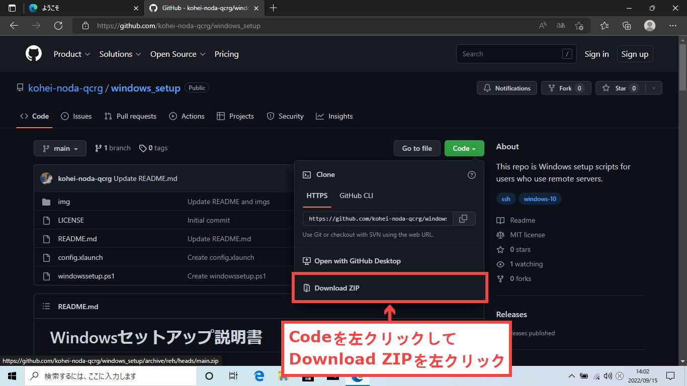
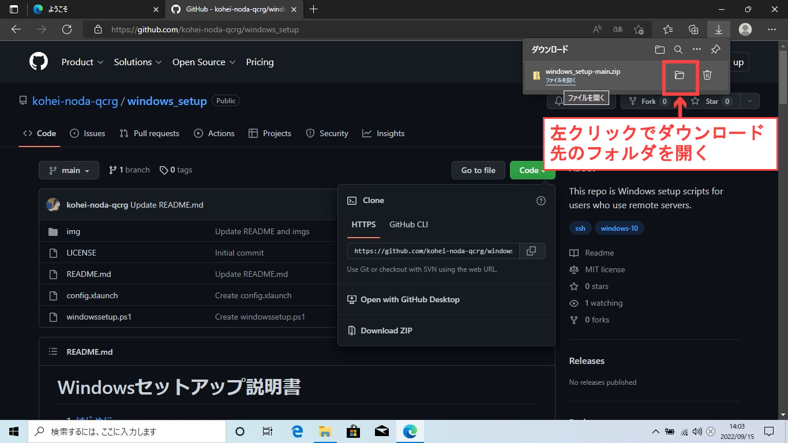
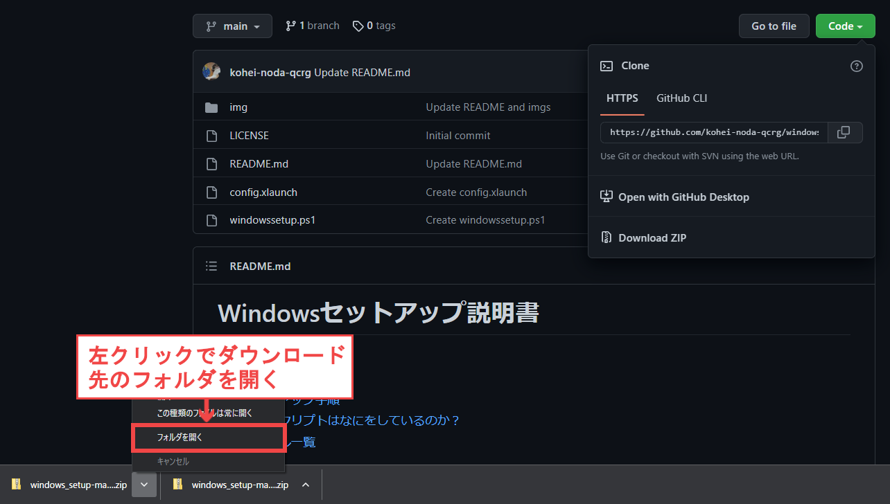
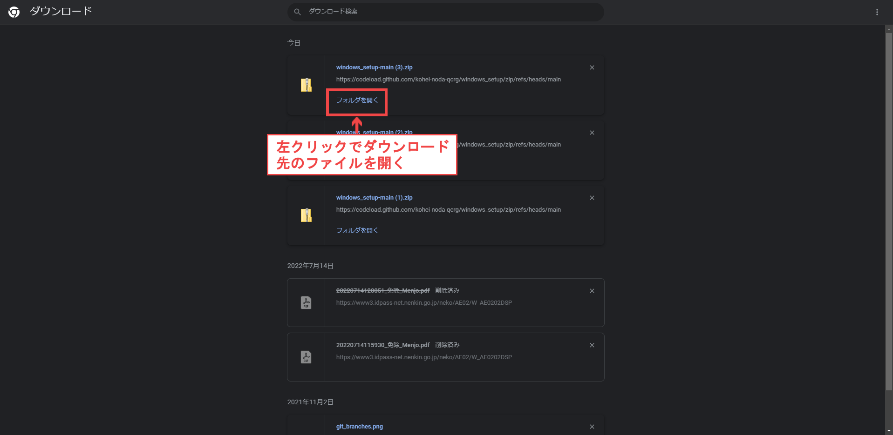
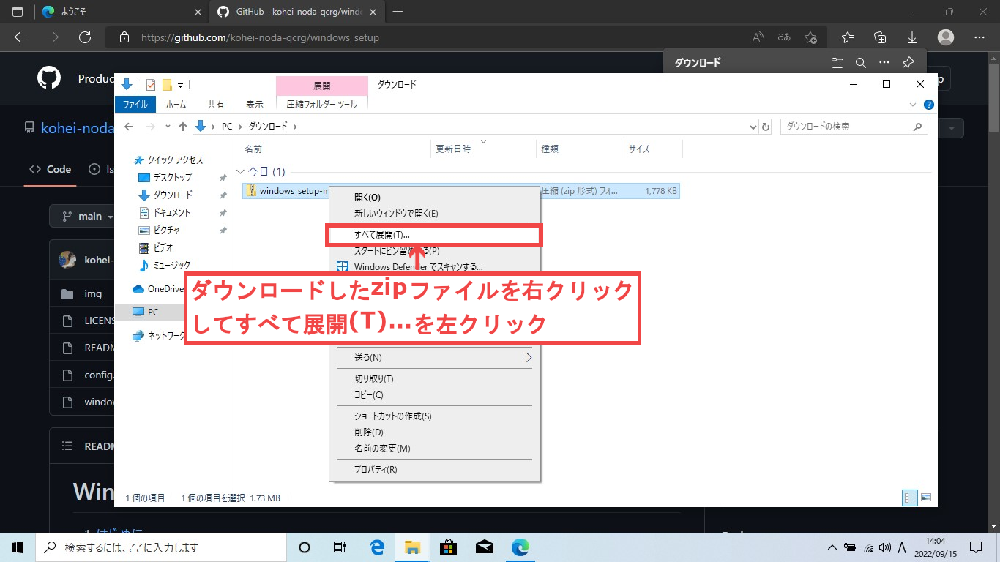
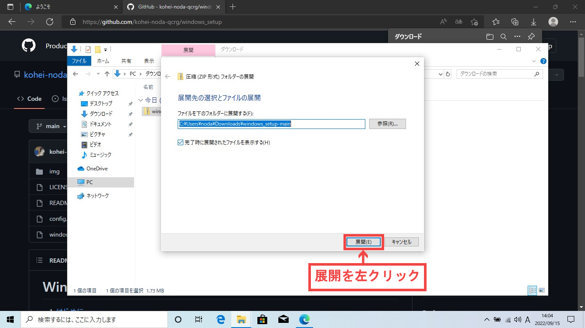
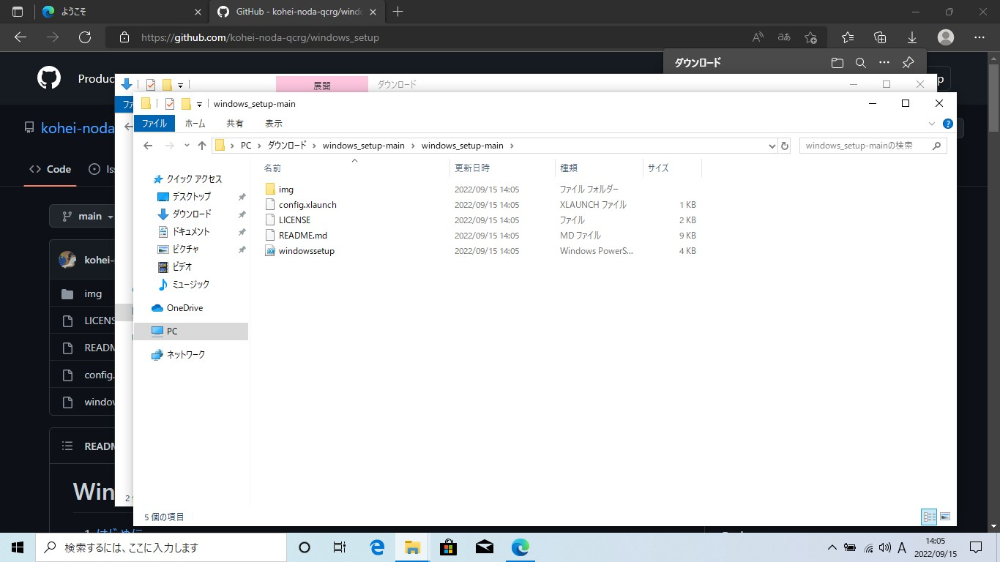
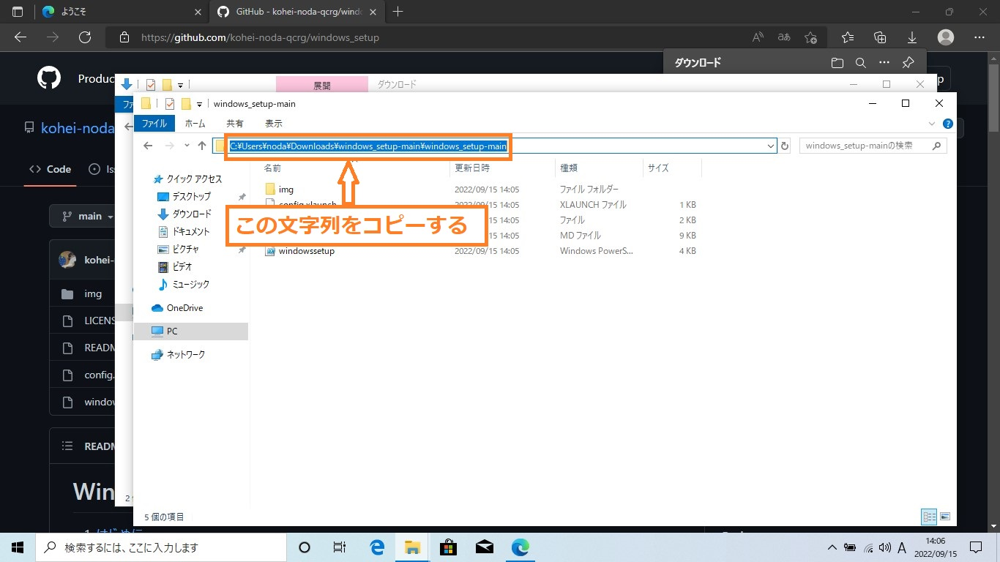
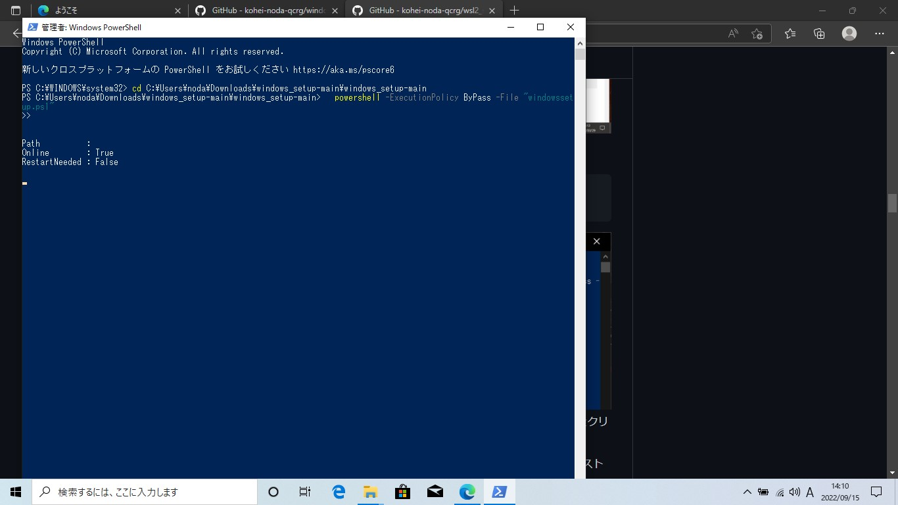

# Windowsセットアップ説明書

<!-- vscode-markdown-toc -->
1. [はじめに](#introduction)
1. [注意](#attention)
1. [セットアップ手順](#setup)
1. [このスクリプトはなにをしているのか？](#whatsdoingthesescripts)
1. [ファイル一覧](#files)
1. [ライセンス](#licence)

## 1. <a name='introduction'></a>はじめに

このリポジトリはリモートサーバでプログラム等を実行したい人に向けて、できるだけ簡単にWindowsのセットアップを可能にするために作られたスクリプト群です  

このスクリプトを実行することで以下のことができるようになります  

- [OpenSSH](https://docs.microsoft.com/ja-jp/windows-server/administration/openssh/openssh_install_firstuse)をインストールすることで、ssh鍵を使ったリモートサーバへのログインが可能になる
- [Visual Studio Code](https://code.visualstudio.com/)を使って便利な拡張機能を使ったテキスト処理、インプットの作成などが可能になる
- $home/.ssh/configを編集することで、sshやrsync,scpなどのコマンドの手順を簡略化できるようになる

## 2. <a name='attention'></a>注意

- 各コマンドは選択してctrl+c(コントロールキーを押しながらcキーを押す)でコピー、ctrl+vで貼り付けすることができます

- インターネットとの通信がかなりあるので<span style="color:darkorange">高速で安定なネットワーク(できれば有線)環境下で実行してください</span>

- ノートパソコンの場合<span style="color:darkorange">充電の残量</span>にも注意してください(基本的には充電しながらのセットアップを推奨します)

## 3. <a name='setup'></a>セットアップ手順

### 3.1. アカウントの確認

- まずはあなたがログイン中のWindowsユーザがWindowsの管理者であることを確認します(管理者でないと以降の作業がうまくいきません)
  - windowsの設定 → アカウント → ユーザの情報 で表示されるユーザのアイコンの下に管理者(又はAdministrator)という文字列があることを確認できればOKです
  - [windowsの設定がどこにあるかわからない場合はこちらを参照してください](https://support.microsoft.com/ja-jp/windows/windows-10-%E3%81%A7%E8%A8%AD%E5%AE%9A%E3%82%92%E8%A6%8B%E3%81%A4%E3%81%91%E3%82%8B-6ffbef87-e633-45ac-a1e8-b7a834578ac6)
  - 管理者でない場合、このスクリプト群は使えないので[管理者になる方法を参照](https://www.fmworld.net/cs/azbyclub/qanavi/jsp/qacontents.jsp?PID=8610-8270)してください

### 3.2. リポジトリのダウンロードと展開

- [このリポジトリ](https://github.com/kohei-noda-qcrg/windows_setup)にアクセスして<span style="background-color:darkgreen;color:white">Code</span>からZipファイルをダウンロードします


- 以下の画像のようにしてダウンロードしたファイルがあるフォルダをエクスプローラーで開きます(ダウンロードしたフォルダが開けるなら他の方法を開いても構いません)

  ※以下のような画面が出てこない場合はctrl+jを押せば以下のような画面になります
  - Microsoft Edge
   

  - Google Chrome
   

  - Google Chrome(ctrl+jで開いた場合)
   

- ダウンロードしたzipファイルの上で右クリックし、すべて展開(T)...を選択し、開かれたウィンドウの展開を選択してファイルを展開します
   
 

- ファイルを展開すると展開したフォルダがエクスプローラーで開かれるので、以下のような画面(windowssetup.ps1があるフォルダ)まで左クリックで移動します


- 今後の手順で使うので、以下の画像の囲まれている部分を左クリックするとフォルダの場所が表示されるので、その文字列をコピーしてください
  **(※今後の手順でコピーした文字列と書いてある部分がありますが、その部分はこの手順でコピーした文字列に読み替え及び手順の実行をしてください)**


### 3.3. Windows上の開発ツール等のインストール

- powershellを<span style="color:darkorange">管理者で実行</span>します  
  

- 以下のコマンドを実行

  ```powershell
    cd コピーした文字列
    powershell -ExecutionPolicy ByPass -File "windowssetup.ps1"
  ```

  

  > <注記>  
  > ソフトウェアのインストールには[winget](https://github.com/microsoft/winget-cli)を使っていますが  
  > [wingetコマンド実行中は文字コードがConsolasに変更されて文字化け](http://mystia04.net/?p=961)します  
  > 動作には問題ないため文字化けに関しては無視してください(スクリプトの実行が終了すると文字化けが解消されます)

  ↓文字化けの様子  
  

### 3.4. SSHの設定

  <span style="color:darkorange">計算機へのログインのためのユーザを作成済み</span>の場合、以下の設定を行ってください  

- [$home/.ssh/config](https://qiita.com/passol78/items/2ad123e39efeb1a5286b#sshconfig%E3%82%92%E6%9B%B8%E3%81%8F%E3%81%A8%E4%BD%95%E3%81%8C%E5%AC%89%E3%81%97%E3%81%84%E3%81%8B)の編集

  - まずPowershellを開いて、\$home/.sshフォルダの作成、configファイルの作成、configファイルをメモ帳で開く操作を以下のコマンドで行います

    ```sh
      mkdir -p $home/.ssh
      New-Item $home/.ssh/config
      notepad $home/.ssh/config
    ```

- configファイルを以下のテンプレートを参考にして編集してください。以下の記事も参考にできると思います
  - [.ssh/configの基本的な考え方と各設定の意味、設定例が載っています](https://qiita.com/0084ken/items/2e4e9ae44ec5e01328f1)
  - [踏み台サーバ経由でログインしたい場合はこちらを参考にしてください](https://qiita.com/ik-fib/items/12e4fab4478e360a82a1)

    <\$home/.ssh/configのテンプレート>

    ```config
      ServerAliveInterval 60
      ServerAliveCountMax 10

      Host ims
        HostName ccfep.center.ims.ac.jp
        User {USER_NAME}
        IdentityFile {IdentityFilePath}
        ForwardX11  yes
        ForwardX11Trusted yes
    ```

    ここまでの設定を行うとUbuntuで

    ```sh
      ssh ims
    ```

    などと打ち込むだけでsshサーバにログイン可能になります  
    [scpコマンド](https://runble1.com/scp-config/#toc2)などもimsなどのHost名で指定できるのでコマンドの簡略化につながります

### 3.6. Cisco anyconnectのインストール(HINET外部のネットワークから HINET内部のコンピュータ接続時に必要)

- 以下のリンクにアクセスしてCisco anyconnectをダウンロード  
[https://www2.media.hiroshima-u.ac.jp/sso/vpngw/anyconnect-win-4.10.05085-core-vpn-predeploy-k9.msi](https://www2.media.hiroshima-u.ac.jp/sso/vpngw/anyconnect-win-4.10.05085-core-vpn-predeploy-k9.msi)

- ダウンロードしたファイルをダブルクリック、ダウンロード

  詳しい使い方は [https://www.media.hiroshima-u.ac.jp/services/hinet/vpngw/#setting](https://www.media.hiroshima-u.ac.jp/services/hinet/vpngw/#setting) を参照してください

## 4. <a name='whatsdoingthesescripts'></a>このスクリプトはなにをしているのか？

以下のことを自動実行しています

- 必要なソフトウェア[VScode](https://code.visualstudio.com/), [7zip](https://sevenzip.osdn.jp/), [WinSCP](https://winscp.net/eng/index.php), [Git for windows](https://gitforwindows.org/), [Windows Terminal](https://www.microsoft.com/ja-jp/p/windows-terminal/9n0dx20hk701), [Teraterm](https://ttssh2.osdn.jp/index.html.ja), [VcXsrv](https://sourceforge.net/projects/vcxsrv/)のインストール
- config.xlaunch (Xサーバ設定用ファイル)を使ったxサーバの設定を行う

## 5. <a name='files'></a>ファイル一覧

- img (README用画像フォルダ)
- config.xlaunch (Xサーバ設定用ファイル)
- do_not_turn_off.pow (スクリプト実行中にスリーブしないように強制させるためのファイル)
- LICENCE (ライセンスファイル)
- windowssetup.ps1 (Windowsに開発に必須/便利なソフトウェアのインストールを行うスクリプト)
- README (このファイル)

## 6. <a name='licence'></a>ライセンス
このプログラムはMITライセンスのもと提供されています  
詳しくは[このリポジトリのライセンスファイル](https://github.com/kohei-noda-qcrg/windows_setup/blob/main/LICENSE)を参照してください
